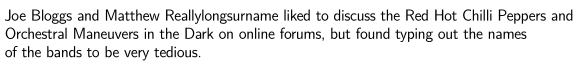
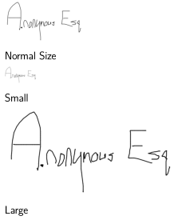

****
Tags
****

kppe supports tags, via an additional markup syntax to provide functionality which *pandoc* does not provide itself. 

Syntax
======

kppe tags have a simple syntax::

  <<TAG NAME:ARGUMENT 1[:ARGUMENT 2]..[:ARGUMENT n]>>

All tags take at least one argument, while some tags take more arguments, ":" seperated.

Tags should be placed alone on a line in the *pandoc* document.

Available Tags
==============

#. :ref:`Abbreviation Tag <abbrev_tag>`

#. :ref:`Action Tag <action_tag>`

#. :ref:`Decision Tag <decision_tag>`

#. :ref:`Heading Tag <heading_tag>`

#. :ref:`Reference Tag <ref_tag>`

#. :ref:`Right Tag <right_tag>`

#. :ref:`Signature Tag <sig_tag>`

.. _abbrev_tag:

Abbreviation Tag
----------------

The abbreviation tag allows abbreviations to be used in documents - valid abbreviation tags are replaced with the text the abbreviation maps to. Its syntax is::
  
  <<abbrev|name|n|a:abbreviation>>

Abbreviations must appear in a section in the configuration file called *Names*, one line per abbreviation, like so:

::
   
   [Names]
   JB = Joe Bloggs
   MRe = Matthew Reallylongsurname
   RHCP = the Red Hot Chilli Peppers
   OMD = Orchestral Maneuvers in the Dark

The command is aliased to "*name*", "*n*" and "*a*", all of which will produce the same result.

Example
^^^^^^^

*Pandoc* markup like this:
 
.. include:: tag_abbrev.txt

will yield a document like so:

.. _action_tag:

Action Tag
----------

The action tag assigns one or more people to an action task for the section or subsection it is specified in. Its syntax is::

  <<action:Person 1[:Person 2]..[:Person n]>>

For each action tag assigned to any particular person (or effectively any string) a summary is inserted at the end of the *pandoc* document, listing each section or subsection in which an action is assigned. For each action tag, a highlighted sentence is inserted at the location of the tag, indicating who the action was assigned to.

Example
^^^^^^^

*Pandoc* markup like this:
 
.. include:: tag_action.txt

will yield a document like so:

.. _decision_tag:

Decision Tag
---------------

The decision tag makes its single argument bold with a red typeface, intended originally for use in indicating decisions approved by Lions meetings.

Example
^^^^^^^

*Pandoc* markup like this:
 
.. include:: tag_decision.txt

will yield a document like so:

.. _heading_tag:

Heading Tag
-----------

The heading tag emphasises and centralises each of its arguments, particularly useful to to provide a heading for a document.

Example
^^^^^^^

*Pandoc* markup like this:
 
.. include:: tag_heading.txt

will yield a document like so:

.. _ref_tag:

Reference Tag
-------------

Reference tags specify that a particular section is related to a pre-defined topic. For each reference tag, a listing is placed into a section at the end of the document with the hardcoded title "District Projects" (but before the list of actions, if there is one), linking the topics to the sections in which the tags appear. The topics are currently also hardcoded, although a future version of the application will make both the section title and the topics configurable. Some topics also have a hardcoded prefix which is added to the listing. If there are no tags in the document for a topic, the text "Nothing to report" is inserted, unless the topic has a prefix, in which case only the prefix is used.

As the topics and the section title are hardcoded, the reference tag is perhaps the aspect of kppe which is most specific to the North Durban Lions Club and Lions in general.

The current list of topics and the associated tag name and prefix (if there is one) is:

.. include:: ref_tag_list.rst

Example
^^^^^^^

*Pandoc* markup like this:
 
.. include:: tag_ref.txt

will yield a document like so:

.. _right_tag:

Right Tag
-----------

The right tag right justifies each of its arguments.

Example
^^^^^^^

*Pandoc* markup like this:
 
.. include:: tag_right.txt

will yield a document like so:

.. _sig_tag:

Signature Tag
-------------

The signature tag inserts an image into the document. Its primary intention is for inserting electronic versions of author's signatures into the document (hence its name) but it can insert any image. Its syntax is::

  <<sig:file name:[size]>>

The file name argument is required, and must be the name of a PNG file in the location that kppe is running from. The actual file must have a .png extension, although it must be specified in the tag without the extension.

The second argument optionally specifies the length of the image, in cm. Fractions are permitted. The image is scaled accordingly. If the size is not specified, 3cm is used.

Example
^^^^^^^

*Pandoc* markup like this:
 
.. include:: tag_signature.txt

will yield a document like so:

This is inserting a file called **sample_sig.png**.

